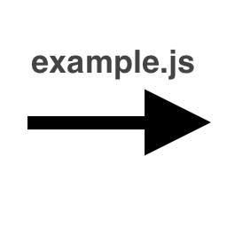

# OTBM2JSON
NodeJS library for programmatically modifying Open Tibia Binary Mapping files. This framework reads .otbm files and parses them to an intermediary JSON format. This JSON structure can be changed programatically to make generic modifications. Once a change has been committed to the structure, it can be encoded back to an .otbm file.

# JSON Structure
The structure of the intermediary JSON format read from and to `.otbm` can be seen in the example `OTBM.json`.

# Usage
Import the library in your script:

    const otbm2json = require("./otbm2json.js");

The library provides two functions for reading and writing OTBM:

    data = otbm2json.read(filename);
    
    ** Modify the data object here **
    
    otbm2json.write(filename, data);

For an example see below.

# Example
An example script `examples/example.js` is provided. This script uses the `examples/void.otbm` (8x8 void area) in this repository and replaces all void tiles with chessboard tiles and writes the result to  `examples/chess.otbm`.

  
  
  

# Version
Current version 0.2.0. This is a work in progress.
